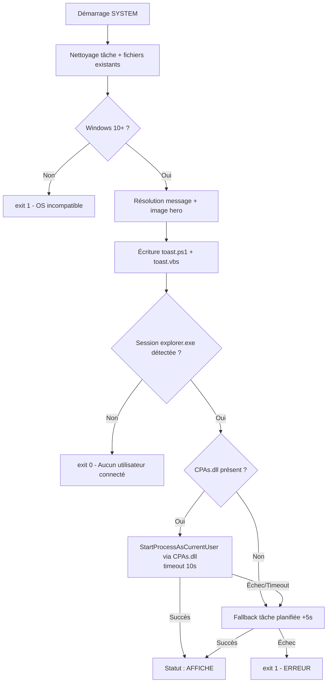

# Toast Notifications Datto RMM

Le composant Toast Notification envoie une notification toast Windows à l'utilisateur connecté sur un poste géré. Il s'exécute en contexte SYSTEM via l'agent Datto, et affiche la notification dans la session utilisateur grâce à CPAs.dll (murrayju.ProcessExtensions).

Version courante : **V9.1** — Mars 2026.

---

## Prérequis

- Windows 10 / Server 2016 minimum
- CPAs.dll inclus comme embedded file dans le composant
- 4 images hero incluses comme embedded files
- Exécution en contexte SYSTEM (agent Datto)

---

## Variables Datto RMM

| Variable | Type | Description |
|---|---|---|
| `usrMessageType` | Sélection | Détermine le message et l'image affichés |
| `usrMessageComplement` | Chaîne | Texte libre affiché sous le message prédéfini |
| `usrShowRestart` | Booléen | Afficher le bouton "Redemarrer maintenant" |
| `usrInfoLabel` | Sélection | Label du bouton lien (ex: "Accéder à mon ticket") |
| `usrInfoURL` | Chaîne | URL du bouton lien — bouton affiché automatiquement si renseigné |

---

## Messages prédéfinis

| Valeur dropdown | Image hero | Titre |
|---|---|---|
| `bienvenue` | hero-bienvenue.png | Bienvenue ! |
| `academy` | hero-information.png | Nouveau parcours sur Power Academy |
| `technicien_termine` | hero-technicien.png | Intervention terminée |
| `ticket_fermeture` | hero-ticket.png | Votre ticket sera bientôt clôturé |
| `ticket_retour` | hero-ticket.png | Votre retour est requis |
| `panne` | hero-information.png | Incident en cours - merci de patienter |
| `injoignable` | hero-ticket.png | Tentative de contact |
| `technicien_info` | hero-information.png | Info de votre technicien |

!!! tip "Valeur par défaut"
    Si `usrMessageType` est absent ou invalide, le script utilise `technicien_info`.

---

## Logique d'exécution



!!! warning "Pas de tâche AtLogOn"
    Si aucun utilisateur n'est connecté au moment de l'exécution, le script quitte proprement sans planifier de toast différé.

---

## Fichiers requis dans le composant

| Fichier | Rôle |
|---|---|
| `CPAs.dll` | Impersonation utilisateur (CreateProcessAsUser) |
| `hero-bienvenue.png` | Image hero — bienvenue |
| `hero-information.png` | Image hero — academy, panne, technicien_info |
| `hero-technicien.png` | Image hero — technicien_termine |
| `hero-ticket.png` | Image hero — ticket_fermeture, ticket_retour, injoignable |

!!! tip "Fallback image"
    Si l'image attendue est introuvable, le script utilise la première `hero*.png` disponible dans le répertoire de travail.

---

## Fichiers générés sur le poste

| Chemin | Rôle |
|---|---|
| `%ProgramData%\CentraStage\ToastNotifications\toast.ps1` | Script PowerShell qui affiche la notification |
| `%ProgramData%\CentraStage\ToastNotifications\toast.vbs` | Lanceur VBS silencieux (fenêtre cachée) |
| `%ProgramData%\CentraStage\ToastNotifications\hero.png` | Copie locale de l'image hero sélectionnée |

---

## Branding

Le nom affiché dans la notification est lu depuis :

```
%ProgramData%\CentraStage\Brand\keys.xml  →  clé productShortNameText
```

Fallback : `Support IT` si la valeur est absente. Le logo circulaire est lu depuis `primaryLogo.png` dans le même répertoire.

---

## Codes de sortie

| Code | Signification |
|---|---|
| `0` | Succès, ou aucun utilisateur connecté (exit propre) |
| `1` | Erreur : OS incompatible, répertoire inaccessible, ou impossible d'écrire les fichiers |

---

## Log StdOut

Le closeout produit deux blocs :

```
============================================
  TOAST NOTIFICATION V9.1
============================================
  Type     : technicien_info
  Titre    : Info de votre technicien
  Corps    : Votre technicien souhaite vous contacter...
  Bouton   : Accéder à mon ticket
  URL      : https://...
  Image    : hero-information.png
  Expire   : 2026-03-15T10:32:00
============================================
  Session  : DOMAIN\username
  Methode  : CPAs.dll
  Statut   : AFFICHE
============================================
```

Valeurs possibles pour `Statut` : `AFFICHE` / `NON AFFICHE` / `ERREUR`.

---

## Recommandations par cas d'usage

| Type | Bouton recommandé | URL |
|---|---|---|
| `bienvenue` | Ouvrir Power Academy | `https://academy.poweriti.com/login` |
| `academy` | Ouvrir Power Academy | Lien direct vers le cours |
| `ticket_fermeture` | Accéder à mon ticket | Lien ticket Autotask |
| `ticket_retour` | Donner mes informations | Lien ticket Autotask |
| `injoignable` | Accéder à mon ticket | Lien ticket Autotask |
| `technicien_termine` | *(aucun)* | — |
| `panne` | *(aucun)* | — |
| `technicien_info` | Optionnel | Selon contexte |

---

## Historique des versions

| Version | Date | Changements principaux |
|---|---|---|
| V9 | Mars 2026 | Messages prédéfinis, scenario `incomingCall`, suppression `usrMessageTitle` et `usrShowInfo`, nouveau format log |
| V9.1 | Mars 2026 | Timeout CPAs.dll 10s via `Start-Job`, expiration toast +2h, try/catch sur écriture disque |

---

## À lire ensuite

- [Composants Datto RMM](composants-datto.md) *(à venir)*
- [Audit OneDrive SharePoint](audit-onedrive-sharepoint.md) *(à venir)*
- [Sync SharePoint Bibliothèque](sync-sharepoint.md) *(à venir)*