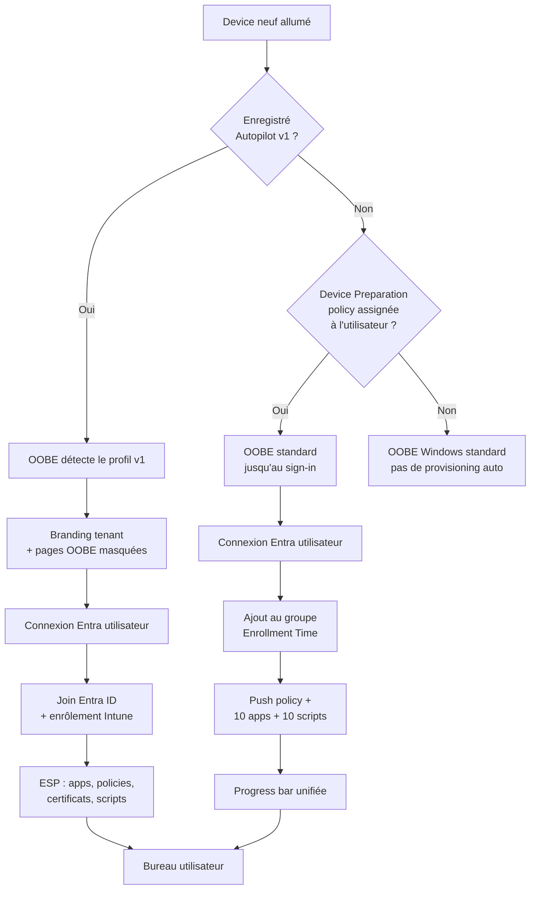

# Windows Autopilot

Autopilot est le service cloud Microsoft pour provisionner des postes Windows directement depuis l'OOBE, sans image ni intervention physique. Le poste sort de son carton, l'utilisateur se connecte, Intune fait le reste.

Deux générations coexistent aujourd'hui dans le même tenant : Autopilot *classic* (v1) et Autopilot *Device Preparation* (v2).

## v1 vs Device Preparation (v2)

| Critère | Autopilot v1 (classic) | Device Preparation (v2) |
|---|---|---|
| Approche | Device-centric (device pré-enregistré) | User-centric (enrôlement au sign-in) |
| Hardware hash | Requis (upload préalable) | Non requis |
| Identité | Entra Join + Entra Hybrid Join | Entra Join uniquement |
| Scénarios | User-driven, Self-deploying, Pre-provisioned, Existing | User-driven, Automatic (Windows 365) |
| Co-management (Intune + ConfigMgr) | Supporté | Non supporté |
| ESP | Enrollment Status Page classique | Progress bar unifiée, pas d'ESP séparé |
| Apps pendant OOBE | Illimité (tracké via ESP) | 10 max (sélection explicite) |
| Scripts PowerShell pré-desktop | Non | Oui (10 max) |
| Reporting | Standard Intune | Near real-time, export diagnostics intégré |
| OS minimum | Windows 10 / 11 | Windows 11 22H2 ou 23H2 + KB5035942, ou 24H2+ |
| Clouds souverains | Commercial | Commercial + GCC High + DoD |
| Type d'appareil par défaut | Corporate | Personal (sauf Corporate Identifier) |

!!! tip "Choix MSP — règle simple"
    - Environnement **cloud-only**, Windows 11, tenant récent → Device Preparation
    - **Hybrid Join**, **Self-deploying** (kiosque, borne), **pre-provisioning** OEM, co-management → v1 obligatoire
    - Les deux peuvent cohabiter dans le même tenant, mais **jamais** sur le même device (v1 prend toujours le dessus).

## Scénarios v1 en bref

- **User-driven** : l'utilisateur déballe, se connecte avec son compte Entra, le device se joint et s'enrôle. Le cas 90 % des déploiements MSP.
- **Self-deploying** : aucun utilisateur pendant l'OOBE. Requiert TPM 2.0 avec attestation. Utile pour bornes, salles de réunion, kiosques.
- **Pre-provisioned** (ex-White Glove) : le technicien fait tourner l'ESP côté device en atelier, l'utilisateur finit en quelques minutes à la réception. Pratique pour les flottes livrées au MSP avant dispatch.
- **Existing device** : conversion d'un poste déjà en production vers Autopilot, via un package Intune.

## Prérequis Entra ID et licences

Côté **licences** (v1 comme v2) :

- Intune (inclus dans M365 Business Premium, M365 E3/E5, EMS E3/E5)
- Entra ID P1 minimum (MDM auto-enrollment, group-based targeting)

Côté **tenant Entra** :

- MDM auto-enrollment configuré : *Entra admin center → Mobility (MDM and WIP) → Microsoft Intune → User scope = All ou Some*
- Branding de la page de connexion configuré (sinon OOBE affiche un message d'erreur trompeur)
- Device settings : *Users may join devices to Microsoft Entra* = All (ou scope groupe)

Spécifique **Device Preparation (v2)** :

- Groupe de sécurité Entra **assignable** (pas dynamique) pour l'*Enrollment Time Grouping*
- Le compte de service `Intune Autopilot ConfigurationManager` doit être **Owner** du groupe (sinon le device ne peut pas s'ajouter au groupe pendant l'enrôlement — erreur classique)
- Optionnel mais recommandé : *Corporate Identifiers* (serial, manufacturer, model) pour marquer les devices comme Corporate

!!! warning "Piège Device Preparation"
    Si le groupe assignable n'a pas le bon propriétaire, le déploiement échoue avec une erreur générique sans pointer la cause. Vérifier les propriétaires du groupe *avant* le premier test.

## Workflow de provisionnement

## Cas d'usage MSP

- **Nouveau client cloud-first Windows 11** : partir directement sur Device Preparation. Pas de hash à collecter, onboarding plus rapide.
- **Client existant avec AD on-prem + ConfigMgr** : rester sur v1 Hybrid Join tant que la migration Entra Join n'est pas terminée.
- **Flotte de bornes / salles de réunion** : v1 Self-deploying, pas d'alternative en v2 aujourd'hui.
- **Préparation atelier avant livraison** : v1 Pre-provisioned. Le technicien valide le device, l'utilisateur final reçoit un poste quasi prêt.

## Pièges courants

!!! danger "Actions irréversibles"
    - Supprimer un device d'Autopilot **ne** le désenrôle **pas** d'Intune automatiquement. Toujours faire les deux.
    - Passer un device de v1 à v2 impose de le désenregistrer d'Autopilot **et** de le retirer d'Intune/Entra avant reset.

!!! warning "À vérifier avant chaque déploiement"
    - Heure système du device correcte (sinon échec TLS avec les services Autopilot)
    - Connexion réseau câblée ou Wi-Fi avec accès aux [endpoints Autopilot requis](https://learn.microsoft.com/en-us/autopilot/requirements-network)
    - Utilisateur a bien une licence Intune **avant** le premier sign-in (erreur la plus fréquente)

## À lire ensuite

- [Collecter le hardware hash avec Get-WindowsAutopilotInfo](autopilot-hash.md) *(à venir)*
- [Configurer une politique Device Preparation pas à pas](autopilot-v2-setup.md) *(à venir)*
- [Troubleshooting ESP et codes d'erreur courants](autopilot-troubleshooting.md) *(à venir)*
