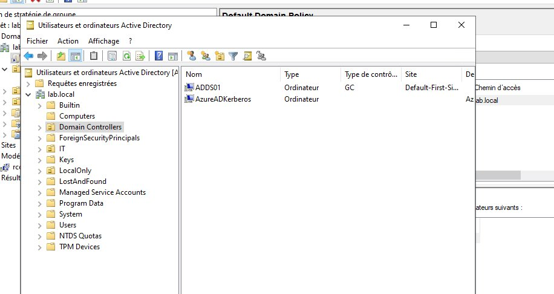
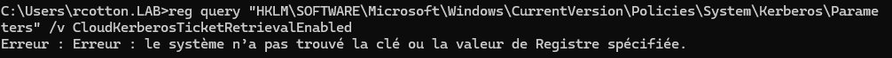
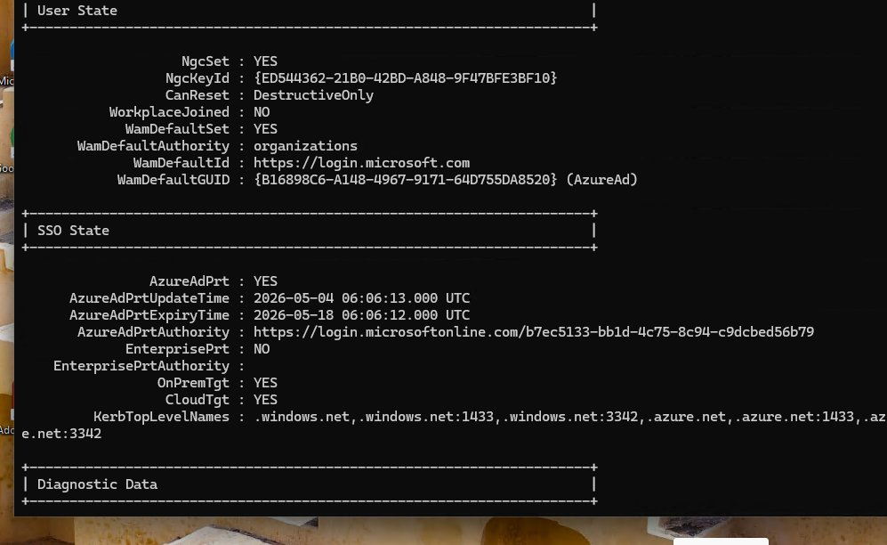
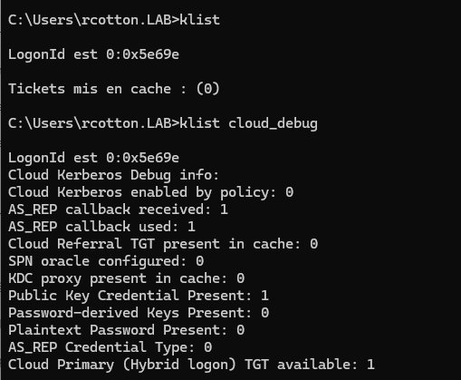
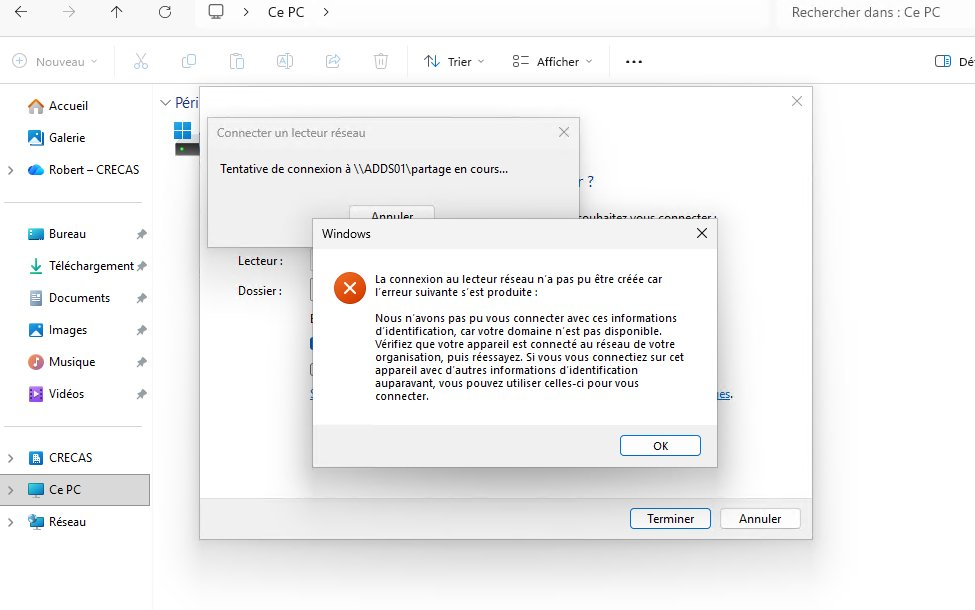

# Cloud Kerberos Trust — Accès SMB on-prem depuis PC Entra Joined

Permettre à un PC Entra Joined (full cloud, sans AD Join) d'accéder à un partage SMB on-prem en SSO, sans popup de credentials, en s'appuyant sur le mécanisme Cloud Kerberos Trust de Microsoft Entra ID.

## Contexte

Dans un scénario full cloud, les PC sont Entra Joined mais les ressources fichiers restent on-prem (serveur Windows, Synology...). Sans configuration particulière, Windows ne sait pas s'authentifier en Kerberos AD depuis un PC Entra Joined → popup credentials ou erreur "domaine non disponible".

Le Cloud Kerberos Trust résout ce problème : Entra ID émet un TGT partiel Kerberos qui est échangé contre un TGT complet auprès du DC on-prem, permettant le SSO vers les ressources AD.

## Architecture du lab

| Rôle | Détail |
|---|---|
| DC | Windows Server 2022, domaine `lab.local`, IP `192.168.1.10` |
| Serveur de fichiers | Partage `\\ADDS01.lab.local\partage` joint au domaine |
| PC test | Windows 11, Entra Joined (pas AD), enrollé Intune |
| Tenant Entra | `crecas84.onmicrosoft.com` |
| Sync | Entra Connect fonctionnel |

## Prérequis

- DC Windows Server 2016 minimum (2022 recommandé)
- Entra Connect en place et synchronisant les users
- PC Entra Joined enrollé dans Intune
- Compte Global Admin ou Hybrid Identity Administrator sur le tenant
- PowerShell 5.1 sur le DC

!!! warning "PowerShell 5.1 obligatoire"
    Le module `AzureADHybridAuthenticationManagement` ne fonctionne pas correctement sous PowerShell 7.

## Étape 1 — Installer le module sur le DC

Sur le DC, en PowerShell 5.1 en tant qu'administrateur :

```powershell linenums="1"
# TLS 1.2 obligatoire pour accéder à PSGallery
[Net.ServicePointManager]::SecurityProtocol = `
  [Net.ServicePointManager]::SecurityProtocol -bor [Net.SecurityProtocolType]::Tls12

# Installation du module
Install-Module -Name AzureADHybridAuthenticationManagement -AllowClobber
Import-Module -Name AzureADHybridAuthenticationManagement
```

## Étape 2 — Créer l'objet Kerberos Server dans AD

```powershell linenums="1"
$domain = $env:USERDNSDOMAIN  # lab.local

# Credentials Global Admin Entra
$cloudCred = Get-Credential  # admin@crecas84.onmicrosoft.com

# Credentials Domain Admin AD local
$domainCred = Get-Credential  # lab\administrator

# Création de l'objet dans AD + publication vers Entra ID
Set-AzureADKerberosServer -Domain $domain `
    -CloudCredential $cloudCred `
    -DomainCredential $domainCred

# Vérification
Get-AzureADKerberosServer -Domain $domain `
    -UserPrincipalName "admin@crecas84.onmicrosoft.com" `
    -DomainCredential $domainCred
```

Résultat : un objet `AzureADKerberos` apparaît dans l'OU Domain Controllers.



## Étape 3 — Activer la policy via Intune

Dans Intune → Settings Catalog → nouvelle policy :

- Platform : Windows 10 and later
- Paramètre : `Use Cloud Trust For On Prem Auth` → **Enabled**
- Assign : groupe de devices Entra Joined

!!! tip "Alternative GPO"
    `Computer Configuration > Administrative Templates > Windows Components > Windows Hello for Business > Use Cloud Trust For On Prem Auth`

### Vérification de la clé de registre

Malgré un statut "Succeeded" dans Intune, vérifier que la clé est bien écrite :

```cmd
reg query "HKLM\SOFTWARE\Microsoft\Windows\CurrentVersion\Policies\System\Kerberos\Parameters" /v CloudKerberosTicketRetrievalEnabled
```

!!! warning "Clé absente malgré policy Succeeded"
    Problème rencontré en lab : la policy Intune affiche "Succeeded" mais la clé de registre n'est pas créée. Solution temporaire — écrire la clé manuellement :

    ```cmd
    reg add "HKLM\SOFTWARE\Microsoft\Windows\CurrentVersion\Policies\System\Kerberos\Parameters" /v CloudKerberosTicketRetrievalEnabled /t REG_DWORD /d 1 /f
    ```

    Puis déconnecter/reconnecter la session.



## Étape 4 — Vérifications côté client

Après reconnexion de session :

```cmd
dsregcmd /status
```

Dans la section SSO State, vérifier :

| Champ | Valeur attendue |
|---|---|
| `AzureAdPrt` | YES |
| `OnPremTgt` | YES |
| `CloudTgt` | YES |



```cmd
klist
klist cloud_debug
```

`klist` doit afficher un ticket `krbtgt/LAB.LOCAL` avec KDC `ADDS01.lab.local`.



## Étape 5 — Tester le mapping SMB

```cmd
net use Z: \\ADDS01.lab.local\partage
```

!!! danger "Utiliser le FQDN"
    Toujours utiliser le FQDN complet (`ADDS01.lab.local`) et non le nom court (`ADDS01`). Le PC Entra Joined n'a pas le suffixe DNS `lab.local` configuré automatiquement.

## Points de blocage rencontrés

### DNS — suffixe lab.local absent

Le PC avait `lan` comme suffixe DNS principal (hérité du DHCP box). `nslookup ADDS01` échouait alors que `nslookup ADDS01.lab.local 192.168.1.10` fonctionnait.



Solution : toujours utiliser le FQDN, ou déployer le suffixe DNS `lab.local` via Intune (Settings Catalog → DNS suffixes).

### Permissions NTFS insuffisantes

Le dossier partagé n'avait pas `Utilisateurs du domaine` dans les ACL NTFS. Ajouter via PowerShell :

```powershell linenums="1"
$acl = Get-Acl "C:\partage"
$rule = New-Object System.Security.AccessControl.FileSystemAccessRule(
    "LAB\Utilisateurs du domaine", "Modify",
    "ContainerInherit,ObjectInherit", "None", "Allow"
)
$acl.AddAccessRule($rule)
Set-Acl "C:\partage" $acl
```

### Cloud Kerberos enabled by policy: 0

Sur un PC Hybrid Joined, ce champ reste à `0` car le TGT Kerberos AD est obtenu directement — c'est normal. Le Cloud Kerberos Trust n'est actif (`1`) que sur les PC Entra Joined purs sans lien AD direct.

## Rotation de la clé Kerberos

À effectuer périodiquement (même fréquence que la rotation krbtgt AD) :

```powershell linenums="1"
Set-AzureADKerberosServer -Domain $domain `
    -CloudCredential $cloudCred `
    -DomainCredential $domainCred `
    -RotateServerKey
```

!!! tip
    La propagation de la nouvelle clé entre les KDC peut prendre plusieurs heures. Ne pas tourner plus d'une fois par 24h sans le paramètre `-Force`.

## À lire ensuite

- [dsregcmd](../refs/dsregcmd.md)
