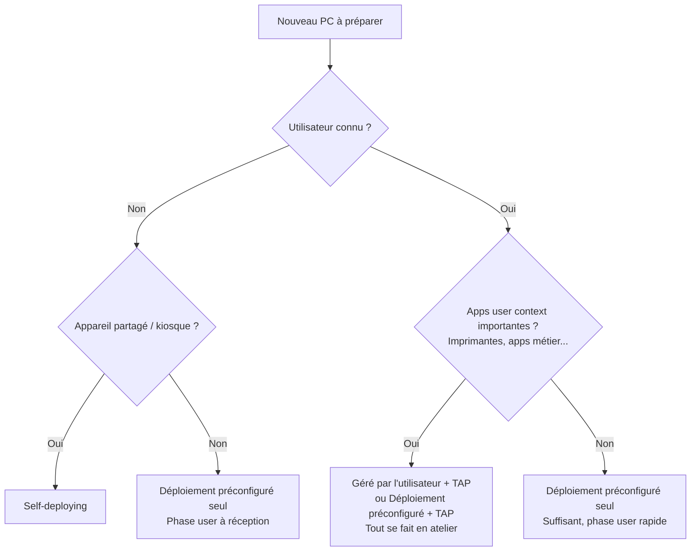

# Autopilot v1 — Modes de déploiement et TAP

Autopilot v1 propose trois façons de provisionner un PC. Le choix du mode impacte directement le workflow en atelier, l'expérience utilisateur à réception, et ce qui est installé à quel moment. Cette page compare les trois modes et montre comment le TAP + Web Sign-in peut compléter le workflow MSP.

## Les trois modes Autopilot v1

### Géré par l'utilisateur (user-driven)

C'est le mode par défaut. L'utilisateur (ou le tech en atelier) se connecte pendant l'OOBE avec un compte Entra ID. Tout s'installe d'un coup : scope device et scope user.

Dans le profil Autopilot, le mode de déploiement est "Géré par l'utilisateur" et "Autoriser le déploiement préconfiguré" est sur Non.

Avantages :

- Simple à configurer, un seul profil Autopilot suffit
- Tout s'installe en une seule passe (apps device + apps user, OneDrive, mail, imprimantes)
- Le PC est 100% prêt après l'OOBE

Inconvénients :

- Le tech en atelier doit connaître le mot de passe de l'utilisateur pour se connecter à sa place
- L'OOBE complet peut être long (30-60 min selon le nombre d'apps)
- Si l'utilisateur fait l'OOBE lui-même, il subit toute l'attente à réception
- Problème de sécurité : le tech qui se connecte avec le mot de passe utilisateur a accès à son compte

### Déploiement préconfiguré (pre-provisioning / ex white glove)

Le provisioning se fait en deux phases distinctes. Le tech fait la phase device en atelier, le PC est scellé, puis l'utilisateur finalise la phase user à réception.

Dans le profil Autopilot, le mode de déploiement est "Géré par l'utilisateur" et "Autoriser le déploiement préconfiguré" est sur Oui.

En atelier, le tech appuie 5 fois sur la touche Windows pendant l'OOBE pour accéder à l'écran de provisioning technicien.

Avantages :

- Le tech n'a pas besoin du mot de passe utilisateur pour la phase device
- Possibilité de préparer des PC en lot sans savoir qui les utilisera
- La phase user à réception est plus courte qu'un OOBE complet
- Séparation claire entre le travail du tech et celui de l'utilisateur

Inconvénients :

- Les apps ciblées en user context ne s'installent qu'à la réception (mail, OneDrive KFM, imprimantes mappées, apps spécifiques au rôle)
- L'utilisateur a quand même une phase de setup à faire lui-même
- WHfB ne se configure qu'à la phase user
- Nécessite TPM 2.0 fonctionnel pour la phase technicien

### Self-deploying (déploiement autonome)

Le PC se provisionne entièrement seul, sans aucune interaction utilisateur. Conçu pour les kiosques, salles de réunion, appareils partagés.

Dans le profil Autopilot, le mode de déploiement est "Self-deploying (preview)".

Avantages :

- Aucune intervention humaine pendant le provisioning
- Pas besoin de credentials utilisateur
- Idéal pour les appareils sans affinité utilisateur

Inconvénients :

- Pas d'affinité utilisateur-appareil : rien en user context ne s'installe
- Nécessite TPM 2.0 avec attestation (peut poser problème sur certains modèles)
- Pas de déploiement préconfiguré possible
- L'utilisateur qui se connecte ensuite déclenche tout le scope user, sans optimisation OOBE
- Pas adapté pour les PC attribués à un utilisateur précis

!!! danger "Self-deploying pour des PC utilisateurs"
    Utiliser le self-deploying pour des PC destinés à des utilisateurs individuels est un détournement du scénario prévu par Microsoft. Ça fonctionne, mais l'utilisateur subit toute l'installation user context au premier login, sans les optimisations de l'OOBE user-driven.

## Tableau comparatif

| Critère | Géré par l'utilisateur | Déploiement préconfiguré | Self-deploying |
|---------|----------------------|--------------------------|----------------|
| Intervention tech en atelier | Oui (OOBE complet) | Oui (phase device) | Non |
| Mot de passe user nécessaire | Oui | Non (phase device) | Non |
| Apps device context | ✅ en atelier | ✅ en atelier | ✅ auto |
| Apps user context | ✅ en atelier | ❌ à réception | ❌ au premier login |
| WHfB configuré en atelier | ✅ | ❌ | ❌ |
| Préparation en lot (stock) | ❌ | ✅ | ✅ |
| TPM 2.0 attestation requis | Non | Oui | Oui |
| Affinité utilisateur | ✅ | ✅ | ❌ |
| Option déploiement préconfiguré | N/A | Oui | Non disponible |

## L'apport du TAP + Web Sign-in

Le TAP combiné avec Web Sign-in change la donne pour le mode géré par l'utilisateur et le déploiement préconfiguré.

### Géré par l'utilisateur + TAP

Le tech fait l'OOBE en atelier avec un TAP au lieu du mot de passe utilisateur. Le workflow devient :

1. Le tech génère un TAP pour l'utilisateur dans Entra ID
2. Pendant l'OOBE, il entre l'email de l'utilisateur et le TAP
3. Le PC s'enrôle au nom de l'utilisateur
4. Tout s'installe : scope device + scope user
5. WHfB se configure (le tech crée un PIN temporaire)
6. Le TAP expire, le tech n'a jamais connu le mot de passe

Avantages par rapport au user-driven classique :

- Le tech ne connaît jamais le mot de passe de l'utilisateur
- Le TAP expire automatiquement après utilisation
- Le PC arrive 100% prêt chez le client
- Même résultat qu'avant, mais sans le problème de sécurité

Inconvénients :

- Il faut générer un TAP par utilisateur et par PC (étape manuelle dans Entra)
- Le PC est lié à un utilisateur précis dès l'atelier, pas de préparation en lot/stock
- Le tech connaît le PIN temporaire qu'il a configuré (l'utilisateur doit le changer)
- Le TAP a une durée de vie limitée, si le provisioning traîne il faut en regénérer un

### Déploiement préconfiguré + TAP

C'est la combinaison la plus complète. Le tech fait d'abord la phase device (déploiement préconfiguré), puis enchaîne avec un login TAP pour déclencher la phase user, le tout en atelier.

1. Le tech appuie 5 fois sur Windows à l'OOBE → phase device
2. Les apps device s'installent, le PC affiche "Réussite"
3. Au lieu de sceller (Reseal), le tech continue l'OOBE
4. Il se connecte avec le TAP de l'utilisateur
5. La phase user se déclenche : mail, OneDrive, imprimantes, apps user
6. Le PC est livré 100% prêt

Avantages :

- Le PC arrive totalement prêt, aucune attente pour l'utilisateur à réception
- Le tech ne connaît pas le mot de passe
- Les deux phases (device + user) sont faites en atelier

Inconvénients :

- Double manipulation en atelier (phase device + login TAP)
- Nécessite de connaître l'affectation utilisateur au moment de la préparation
- Le PIN temporaire créé par le tech doit être changé par l'utilisateur

!!! tip "Recommandation MSP"
    Pour Poweriti, le déploiement préconfiguré + TAP est le workflow le plus propre quand l'affectation utilisateur est connue. Pour les PC en stock sans utilisateur assigné, le déploiement préconfiguré seul reste la meilleure option : la phase user se fera à réception.

## Quel mode choisir ?

## Prérequis pour utiliser le TAP en atelier

- Web Sign-in activé via Intune (voir [Web Sign-in et TAP](web-sign-in-tap.md))
- TAP activé dans Entra ID > Protection > Méthodes d'authentification
- Le TAP doit être en usage multiple si des redémarrages sont prévus pendant le provisioning
- Connexion internet en atelier

## Le problème du PIN temporaire

Quand le tech se connecte avec un TAP en atelier, WHfB demande de configurer un PIN. Ce PIN est connu du tech. Deux approches pour gérer ça :

La première : demander à l'utilisateur de changer son PIN à réception via Paramètres > Comptes > Options de connexion > PIN > Modifier.

La deuxième : supprimer l'enregistrement WHfB de l'utilisateur dans Entra ID après la préparation. Au prochain login, l'utilisateur devra reconfigurer son PIN lui-même. Plus propre, mais ajoute une étape à réception.

!!! warning "À vérifier"
    Le comportement exact de WHfB après suppression de l'enregistrement dans Entra dépend de la configuration du tenant (cloud trust, key trust, etc.). Tester sur le tenant test avant de mettre en production.
