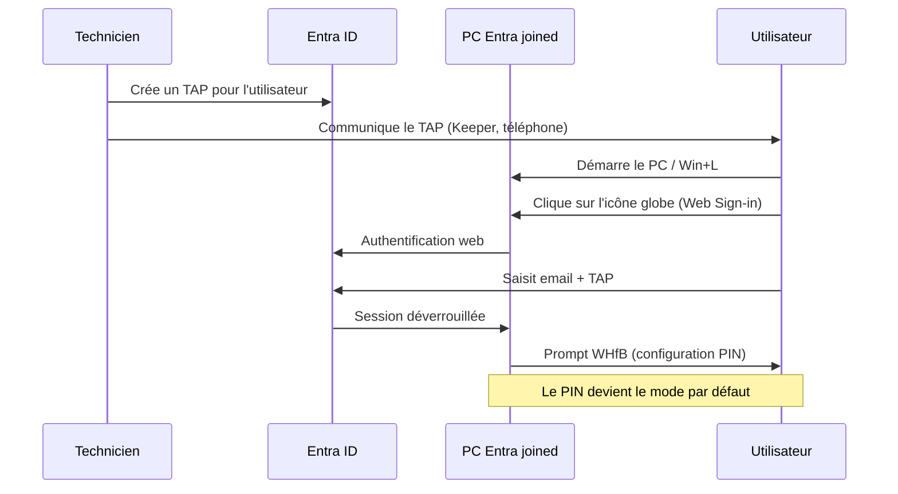

# Web Sign-in et Temporary Access Pass (TAP)

Web Sign-in est un credential provider Windows qui affiche une page d'authentification Entra ID sur l'écran de connexion. Combiné avec un TAP, il permet de déverrouiller une session sans connaître le mot de passe de l'utilisateur. Cas d'usage typique : onboarding Autopilot, reset de méthode d'authentification, dépannage à distance.

## Prérequis

| Élément | Exigence |
|---------|----------|
| Type de jointure | Entra ID joined uniquement |
| Édition Windows | Pro, Enterprise, Education, SE |
| Version minimum | Windows 11 22H2 (KB5030310) |
| Réseau | Connexion internet obligatoire au login |
| Licence Entra | Pas de licence spécifique requise pour TAP |

!!! danger "Hybrid joined et domain joined"
    Web Sign-in ne fonctionne pas sur les appareils hybrid joined ou domain joined, même si le profil Intune s'applique avec succès et que la clé registre est créée. L'authentification cloud aboutit mais le lien avec le DC on-prem est absent.

## Étape 1 — Activer TAP dans Entra ID

1. Aller dans **Entra ID** > **Protection** > **Méthodes d'authentification**
2. Sélectionner **Temporary Access Pass**
3. Activer la policy et cibler les utilisateurs ou groupes souhaités
4. Configurer la durée de vie par défaut et l'usage unique/multiple

!!! tip "Usage unique ou multiple ?"
    Si l'utilisateur doit redémarrer le PC pendant le setup (fréquent avec Autopilot), configurer le TAP en usage multiple. Sinon, usage unique suffit.

## Étape 2 — Créer le profil Web Sign-in dans Intune

1. Aller dans **Intune** > **Appareils** > **Configuration** > **Créer** > **Nouvelle stratégie**
2. Plateforme : **Windows 10 et versions ultérieures**
3. Type de profil : **Catalogue de paramètres**
4. Nommer le profil (ex : `Web Sign-in - Enable`)

Dans **Ajouter des paramètres**, catégorie **Authentication** :

| Paramètre | Valeur |
|-----------|--------|
| Enable Web Sign In | Enabled |

Assigner le profil au groupe d'appareils cible.

## Étape 3 — Forcer le credential provider par défaut sur Password

Sans cette étape, Web Sign-in peut devenir le mode de connexion par défaut. L'utilisateur tombe alors sur le flux web complet (MFA inclus) à chaque déverrouillage.

1. Créer un second profil **Catalogue de paramètres**
2. Nommer le profil (ex : `Default Credential Provider - Password`)

Dans **Ajouter des paramètres**, catégorie **Administrative Templates > System > Logon** :

| Paramètre | Valeur |
|-----------|--------|
| Assign a default credential provider | Enabled |
| GUID du fournisseur | `{60b78e88-ead8-445c-9cfd-0b87f74ea6cd}` |

Assigner au même groupe que le profil Web Sign-in.

!!! tip "Comportement avec WHfB"
    Si l'utilisateur a déjà configuré Windows Hello (PIN, biométrie), WHfB prend le dessus automatiquement. Le GUID password sert surtout pour la tuile "Autre utilisateur" et avant la configuration de WHfB.

!!! info "Alternative : PIN comme credential provider par défaut"
    Il est possible d'utiliser le GUID PIN `{D6886603-9D2F-4EB2-B667-1971041FA96B}` à la place du GUID Password. L'écran de login affichera alors le PIN WHfB en premier. Cette option est pertinente uniquement si tous les utilisateurs ciblés ont déjà configuré WHfB. Si un utilisateur n'a pas encore de PIN (nouvel onboarding, premier login), il devra chercher dans "Options de connexion" pour trouver le mot de passe ou Web Sign-in. Pour un MSP multi-clients, le GUID Password reste le choix le plus sûr car il fonctionne dans tous les cas de figure.

## Étape 4 — Générer un TAP pour un utilisateur

1. Aller dans **Entra ID** > **Utilisateurs** > sélectionner l'utilisateur
2. **Méthodes d'authentification** > **Ajouter** > **Temporary Access Pass**
3. Configurer la durée et l'usage unique/multiple
4. Noter le code affiché — il ne sera plus visible après fermeture

Communiquer le TAP de manière sécurisée (gestionnaire de mots de passe, appel téléphonique).

## Étape 5 — Tester sur un appareil

1. Forcer la synchronisation Intune sur le PC :
    - **Paramètres** > **Comptes** > **Accès professionnel ou scolaire** > cliquer sur la connexion > **Info** > **Synchroniser**
2. Vérifier que les deux profils apparaissent dans les stratégies appliquées :
    - `Authentication` (Web Sign-in)
    - `ADMX_CredentialProviders` (default credential provider)
3. Verrouiller le PC (`Win+L`)
4. Dans **Options de connexion**, cliquer sur l'icône globe (Web Sign-in)
5. Entrer l'adresse email complète de l'utilisateur
6. Saisir le TAP à la place du mot de passe

!!! warning "Première connexion"
    L'icône globe peut ne pas apparaître immédiatement après le déploiement du profil. Il faut parfois un premier login classique + verrouillage avant de la voir.

## GUIDs des credential providers

| Provider | GUID |
|----------|------|
| Password | `{60b78e88-ead8-445c-9cfd-0b87f74ea6cd}` |
| Web Sign-in (Cloud Experience) | `{C5D7540A-CD51-453B-B22B-05305BA03F07}` |
| PIN (WHfB) | `{D6886603-9D2F-4EB2-B667-1971041FA96B}` |
| FIDO2 Security Key | `{F8A1793B-7873-4046-B2A7-1F318747F427}` |

Vérification sur un poste :

```powershell title="Lister les credential providers installés" linenums="1"
Get-ChildItem "HKLM:\SOFTWARE\Microsoft\Windows\CurrentVersion\Authentication\Credential Providers" |
    ForEach-Object {
        [PSCustomObject]@{
            GUID = $_.PSChildName
            Name = (Get-ItemProperty $_.PSPath).'(Default)'
        }
    } | Format-Table -AutoSize
```

## Vérification registre

Pour confirmer que Web Sign-in est bien activé sur un poste :

```powershell title="Vérifier la clé registre Web Sign-in" linenums="1"
Get-ItemProperty "HKLM:\SOFTWARE\Microsoft\PolicyManager\current\device\Authentication" |
    Select-Object EnableWebSignIn
```

La valeur doit être `1`.

## Limitations

- Pas de cache de credentials : sans réseau, Web Sign-in est inutilisable
- Le TAP expiré est automatiquement supprimé des méthodes d'authentification dans Entra
- Web Sign-in n'est pas supporté comme méthode de déverrouillage multi-facteur
- Sur un PC où personne ne s'est encore connecté, l'utilisateur n'apparaît pas sur l'écran de login (pas de tuile utilisateur)

## Scénario MSP typique


