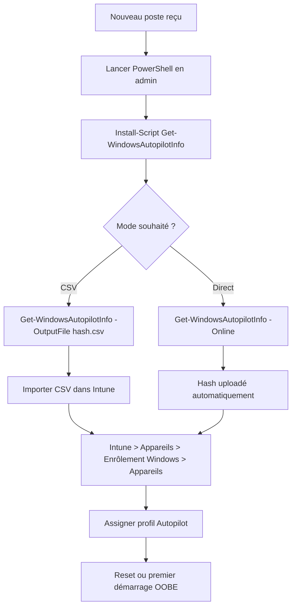

# Get-WindowsAutopilotInfo

`Get-WindowsAutopilotInfo` est un script PowerShell communautaire qui collecte le hardware hash d'un poste Windows, nécessaire pour l'enregistrement dans Windows Autopilot. Il peut exporter le hash en CSV ou l'uploader directement dans Intune.

## Prérequis

- PowerShell 5.1 minimum (PS 7 compatible)
- Droits administrateur local sur le poste
- Accès Internet pour l'installation du script et pour le mode `-Online`
- Pour le mode `-Online` : compte avec le rôle Intune Administrator ou Global Administrator

## Installation du script

```powershell linenums="1"
# Installer depuis la PowerShell Gallery
Install-Script -Name Get-WindowsAutopilotInfo -Force

# Vérifier l'installation
Get-InstalledScript -Name Get-WindowsAutopilotInfo
```

!!! tip "NuGet requis"
    Si le module NuGet n'est pas installé, PowerShell le demandera automatiquement. Accepter l'installation.

## Méthodes de collecte

### Méthode 1 — Export CSV (local)

Génère un fichier CSV à importer manuellement dans Intune.

```powershell linenums="1"
Get-WindowsAutopilotInfo -OutputFile C:\tmp\hash.csv
```

Le fichier CSV contient :
- Device Serial Number
- Windows Product ID
- Hardware Hash
- Group Tag (optionnel)
- Assigned User (optionnel)

Pour importer dans Intune : Appareils > Enrôlement Windows > Appareils > Importer.

### Méthode 2 — Upload direct vers Intune

Upload automatique du hash directement dans le tenant Intune.

```powershell linenums="1"
Get-WindowsAutopilotInfo -Online
```

!!! warning "Authentification interactive"
    Le mode `-Online` ouvre une fenêtre d'authentification Microsoft. Il n'est pas utilisable dans un script non interactif (Datto RMM, Intune). Utiliser le mode CSV dans ce cas.

### Méthode 3 — CSV avec Group Tag

Permet d'assigner directement un Group Tag Autopilot au moment de la collecte.

```powershell linenums="1"
Get-WindowsAutopilotInfo -OutputFile C:\tmp\hash.csv -GroupTag "Poweriti-Standard"
```

!!! tip "Group Tag"
    Le Group Tag permet de cibler automatiquement un profil Autopilot via un groupe dynamique Entra ID. Nommer le tag de manière cohérente pour tous les clients (ex. `NomClient-Profil`).

## Collecte en masse via Datto RMM

Pour collecter le hash sur plusieurs postes simultanément via un composant Datto :

```powershell linenums="1"
# Script Datto RMM — collecte hash et export CSV
$outputPath = "C:\tmp\autopilot-hash-$env:COMPUTERNAME.csv"

# Installer le script si absent
if (-not (Get-InstalledScript -Name Get-WindowsAutopilotInfo -ErrorAction SilentlyContinue)) {
    Install-Script -Name Get-WindowsAutopilotInfo -Force -Confirm:$false
}

Get-WindowsAutopilotInfo -OutputFile $outputPath

if (Test-Path $outputPath) {
    Write-Output "Hash collecté : $outputPath"
} else {
    Write-Error "Échec de la collecte du hash"
    exit 1
}
```

!!! tip "Récupérer les fichiers CSV"
    Dans Datto RMM, utiliser la fonctionnalité "File Transfer" ou stocker les CSV dans un partage réseau accessible pour les regrouper avant import dans Intune.

## Workflow complet



## Cas d'usage MSP fréquents

| Situation | Commande recommandée |
|---|---|
| Nouveau poste livré chez un client | `-OutputFile` + import CSV dans Intune |
| Pré-enregistrement en masse (livraison) | Script Datto RMM avec `-OutputFile` |
| Test rapide sur un poste unique | `-Online` |
| Autopilot avec profil spécifique par client | `-OutputFile` + `-GroupTag NomClient` |

!!! danger "Hash unique par poste"
    Le hardware hash est unique et lié au matériel. Si la carte mère est remplacée, il faut recollecler le hash et ré-enregistrer le poste dans Autopilot.

## À lire ensuite

- [Commandes & références MSP](index.md)
- [dsregcmd — Diagnostic Entra / Intune](dsregcmd.md)
