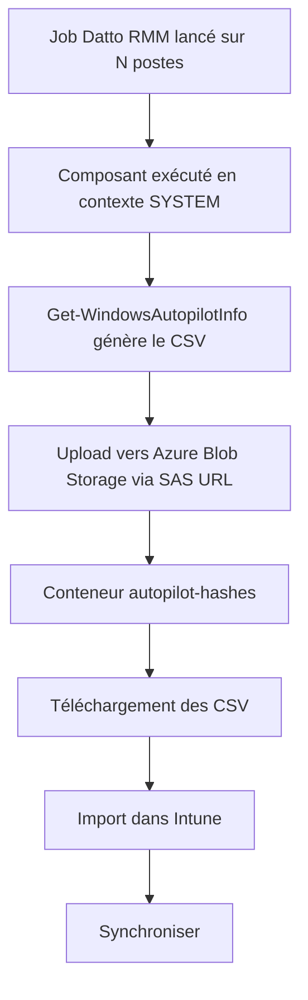
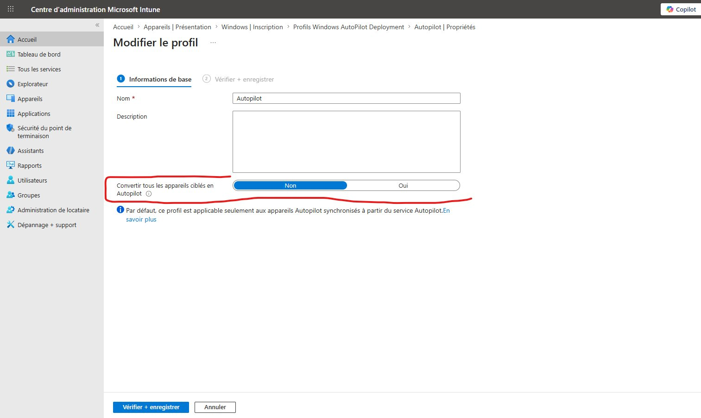
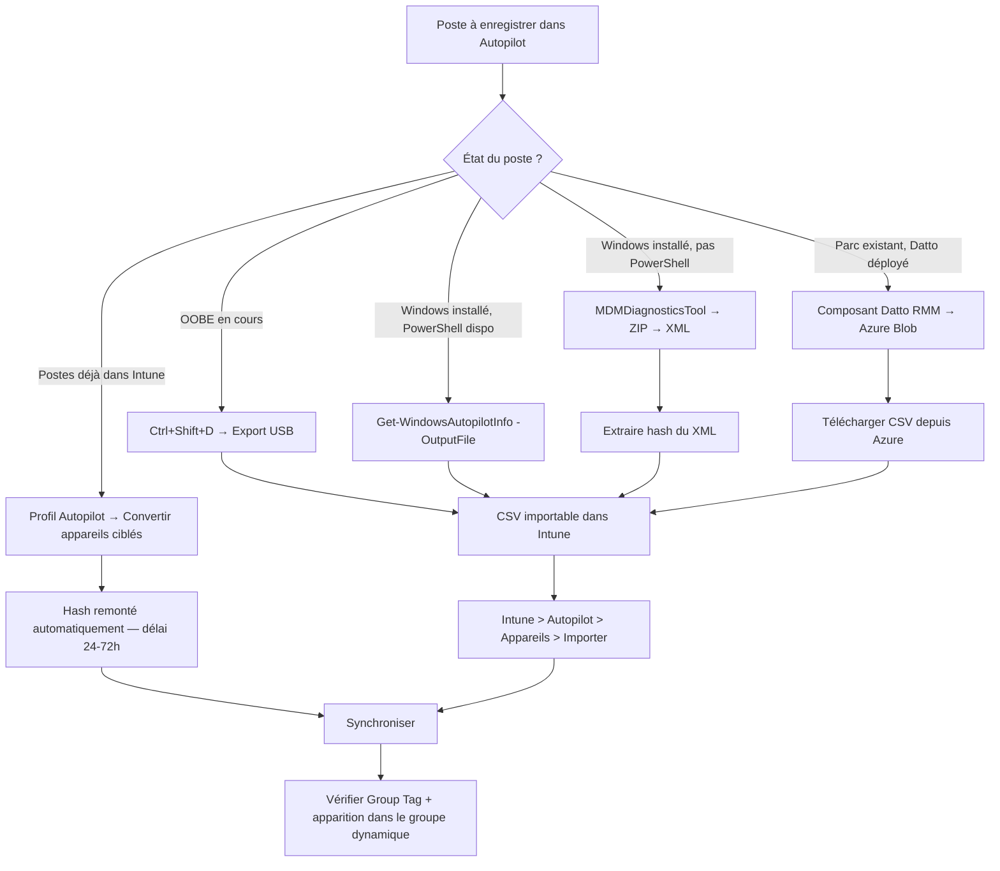

# Collecte du hardware hash Autopilot

Le hardware hash est un identifiant unique généré à partir du matériel du poste (BIOS, carte mère, processeur...). Il doit être importé dans Intune pour que le poste soit reconnu lors de l'OOBE Autopilot.

Il existe plusieurs méthodes pour le collecter, selon le contexte d'intervention.

---

## Comparatif des méthodes

| Méthode | Prérequis | Contexte d'usage |
|---|---|---|
| OOBE — Ctrl+Shift+D | Poste en cours d'OOBE | Nouveau poste non configuré |
| Diagnostic Windows (MDMDiagnostics) | Windows installé, sans PowerShell | Poste existant, accès limité |
| PowerShell Get-WindowsAutopilotInfo | PowerShell admin | Usage courant en lab ou production |
| Datto RMM — composant Azure Blob | Agent Datto déployé | Collecte en masse sur parc existant |
| Profil Autopilot — conversion automatique | Postes déjà enrôlés dans Intune | Migration de parc existant, zéro intervention |

---

## Méthode 1 — OOBE : Ctrl+Shift+D

Utilisable pendant l'assistant de configuration Windows (OOBE), avant toute configuration du poste.

### Procédure

1. Démarrer le poste → attendre l'écran de sélection de langue de l'OOBE
2. Appuyer sur `Ctrl + Shift + D` — une page de diagnostic Autopilot s'ouvre
3. Cliquer sur "Export" — génère un fichier ZIP sur le bureau ou à la racine du lecteur USB
4. Décompresser le ZIP → le fichier `AutopilotDiagnostics.zip` contient un CSV avec le hardware hash
5. Importer le CSV dans Intune : Appareils > Inscription > Windows Autopilot > Appareils > Importer

!!! tip "Clé USB"
    Brancher une clé USB avant d'ouvrir la page de diagnostic. L'export se fait directement sur la clé, ce qui évite d'avoir à récupérer le fichier depuis la partition Windows (qui n'est pas encore configurée).

!!! warning "Fenêtre de temps limitée"
    Cette méthode n'est disponible que pendant l'OOBE, avant la connexion au compte Microsoft. Si l'OOBE est déjà terminée, passer à une autre méthode.

---

## Méthode 2 — Diagnostic Windows (MDMDiagnostics)

Utilisable sur un poste Windows déjà installé, sans nécessiter PowerShell. Accessible depuis l'interface graphique Windows.

### Procédure

1. Ouvrir les Paramètres Windows → Comptes → Accès scolaire ou professionnel
2. Cliquer sur "Exporter vos informations de gestion" (ou utiliser le rapport de diagnostic MDM)
3. Alternativement, exécuter dans une invite de commande :

```cmd
mdmdiagnosticstool.exe -area Autopilot -zip C:\tmp\autopilot-diag.zip
```

4. Décompresser le fichier ZIP généré
5. Dans le dossier extrait, naviguer vers le sous-dossier `DeviceEnrollment` ou `AutopilotDDSZip`
6. Le fichier `DiagnosticReport.xml` ou un fichier CSV contient le hardware hash dans la section dédiée Autopilot

!!! tip "Emplacement du fichier public"
    Sans préciser de chemin, l'outil génère les fichiers dans `C:\Users\Public\Documents\MDMDiagnostics\`. Ce dossier est accessible sans droits admin, ce qui peut être utile pour la récupération à distance.

!!! warning "Hash dans un fichier XML"
    Contrairement au CSV généré par PowerShell, le hash est intégré dans un rapport XML. Il faudra extraire manuellement la valeur ou la parser avant import dans Intune. Préférer PowerShell quand c'est possible.

---

## Méthode 3 — PowerShell : Get-WindowsAutopilotInfo

Méthode de référence. Génère un CSV directement importable dans Intune, avec support du Group Tag.

### Prérequis

- PowerShell 5.1 minimum (PS 7 compatible)
- Droits administrateur local
- Accès Internet (installation depuis la PowerShell Gallery)

### Installation

```powershell linenums="1"
Install-Script -Name Get-WindowsAutopilotInfo -Force
```

!!! tip "NuGet"
    Si NuGet n'est pas installé, PowerShell le proposera automatiquement. Accepter.

### Export CSV (standard)

```powershell linenums="1"
Get-WindowsAutopilotInfo -OutputFile C:\tmp\hash.csv
```

Contenu du CSV généré :

- Device Serial Number
- Windows Product ID
- Hardware Hash
- Group Tag (si précisé)
- Assigned User (si précisé)

### Export CSV avec Group Tag

Le Group Tag permet de cibler automatiquement un profil Autopilot via un groupe dynamique Entra ID.

```powershell linenums="1"
Get-WindowsAutopilotInfo -OutputFile C:\tmp\hash.csv -GroupTag "Poweriti-Standard"
```

!!! tip "Convention de nommage Group Tag"
    Utiliser un format cohérent sur tous les clients : `NomClient-Profil` (ex. `CONTOSO-Standard`, `CONTOSO-Direction`). La règle du groupe dynamique Entra est sensible à la casse.

### Upload direct vers Intune (mode Online)

```powershell linenums="1"
Get-WindowsAutopilotInfo -Online
```

!!! warning "Non utilisable en script non interactif"
    Le mode `-Online` ouvre une fenêtre d'authentification Microsoft interactive. Il ne peut pas être utilisé dans Datto RMM, Intune, ou tout autre contexte automatisé. Utiliser le mode CSV dans ce cas.

### Import dans Intune

Intune > Appareils > Inscription > Windows > Windows Autopilot > Appareils > Importer

Cliquer sur Synchroniser après l'import. Délai d'apparition : 5 à 15 minutes.

---

## Méthode 4 — Datto RMM : composant Azure Blob

Méthode recommandée pour la collecte en masse sur un parc existant. Le composant collecte le hash et l'uploade automatiquement dans un conteneur Azure Blob Storage, sans intervention manuelle poste par poste.

### Architecture


```mermaid
graph TD
    A[Job Datto RMM lancé sur N postes] --> B[Composant exécuté en contexte SYSTEM]
    B --> C[Get-WindowsAutopilotInfo génère le CSV]
    C --> D[Upload vers Azure Blob Storage via SAS URL]
    D --> E[Conteneur autopilot-hashes]
    E --> F[Téléchargement des CSV]
    F --> G[Import dans Intune]
    G --> H[Synchroniser]
```

### Variables du composant

| Variable | Description | Obligatoire |
|---|---|---|
| `SAS_URL` | URL SAS du conteneur Azure Blob (droits Write) | Oui |
| `GROUP_TAG` | Group Tag Autopilot à assigner | Oui |

### Script du composant

```powershell linenums="1"
# Variables injectées par Datto RMM
$sasUrl   = $env:SAS_URL
$groupTag = $env:GROUP_TAG

# Installation de Get-WindowsAutopilotInfo
Install-Script -Name Get-WindowsAutoPilotInfo -Force -Scope AllUsers

# Génération du CSV avec Group Tag
$csvPath = "C:\Windows\Temp\$env:COMPUTERNAME-hash.csv"
Get-WindowsAutoPilotInfo -OutputFile $csvPath -GroupTag $groupTag

# Upload vers Azure Blob Storage
$blobUrl     = "$sasUrl/$env:COMPUTERNAME-hash.csv"
$headers     = @{ "x-ms-blob-type" = "BlockBlob" }
$fileContent = Get-Content $csvPath -Raw

Invoke-RestMethod -Uri $blobUrl -Method Put -Headers $headers -Body $fileContent
Write-Host "Upload terminé : $env:COMPUTERNAME-hash.csv"
```

### Prérequis Azure

- Storage Account existant (ex. `stimages84`, region `francecentral`)
- Conteneur Blob dédié (ex. `autopilot-hashes`)
- SAS URL générée avec droits Read, Write, List — expiration suffisante (minimum 7 jours pour un grand parc)

!!! danger "SAS URL = donnée sensible"
    Une SAS URL expose un accès en écriture à ton stockage Azure. Ne jamais la stocker en clair dans IT Glue ou un ticket. Configurer une alerte budget Azure pour détecter une utilisation anormale.

!!! warning "SAS URL expirée"
    Vérifier la date d'expiration avant de lancer un job sur grand parc. Un SAS expiré provoque des erreurs silencieuses sur les postes concernés — le hash n'est pas uploadé.

### Import dans Intune après collecte

1. Télécharger les CSV depuis le conteneur Azure (Azure Storage Explorer ou portail Azure)
2. Fusionner les CSV si nécessaire (voir script `merge-csv.ps1`)
3. Intune > Appareils > Inscription > Windows > Windows Autopilot > Appareils > Importer
4. Cliquer sur Synchroniser
5. Vérifier que chaque appareil apparaît avec le bon Group Tag

!!! tip "Multi-tenant MSP"
    Nommer les conteneurs Azure par client (`autopilot-client1`, `autopilot-client2`) pour isoler les hashs. Conserver les CSV dans IT Glue comme source de vérité par client.

---

## Méthode 5 — Profil Autopilot : conversion automatique des appareils ciblés

Méthode la plus simple pour migrer un parc existant déjà enrôlé dans Intune. Aucune collecte manuelle de hash, aucune intervention poste par poste. Intune pousse automatiquement un script PowerShell sur les postes ciblés qui collecte et remonte le hash au service Autopilot.

### Principe

Lors de la création ou modification d'un profil de déploiement Autopilot, l'option "Convertir tous les appareils ciblés en Autopilot" est disponible. En la basculant sur Oui, Intune déploie silencieusement `Get-WindowsAutopilotInfo` sur tous les postes du groupe cible. Le hash est collecté et enregistré automatiquement dans la liste Autopilot du tenant, sans action utilisateur ni technicien.



### Procédure

1. Intune > Appareils > Inscription > Windows > Windows Autopilot > Profils de déploiement
2. Créer ou modifier un profil existant
3. Dans l'onglet "Informations de base", basculer "Convertir tous les appareils ciblés en Autopilot" sur **Oui**
4. Assigner le profil au groupe d'appareils cible
5. Attendre — les postes remontent dans Autopilot dans un délai de quelques heures à quelques jours selon la fréquence de synchronisation Intune

### Vérification

Intune > Appareils > Inscription > Windows > Windows Autopilot > Appareils — les postes apparaissent progressivement avec leur numéro de série.

!!! tip "Compatible AD Connect (environnement hybride)"
    Cette méthode fonctionne aussi sur les postes joints à un Active Directory local synchronisés via Entra Connect (ex-Azure AD Connect). Les postes hybrides déjà visibles dans Intune reçoivent le script de la même façon. Aucune configuration supplémentaire n'est requise côté AD.

!!! warning "Délai variable"
    Le délai de remontée dépend de la fréquence de check-in Intune des postes (toutes les 8h par défaut). Sur un grand parc, prévoir 24 à 72h pour que tous les postes soient enregistrés.

!!! warning "Group Tag non assigné automatiquement"
    Cette méthode n'assigne pas de Group Tag aux appareils convertis. Il faudra les assigner manuellement dans Intune > Autopilot > Appareils, ou utiliser une autre méthode si le Group Tag est critique pour le ciblage des profils.

---

## Workflow global


```mermaid
graph TD
    A[Poste à enregistrer dans Autopilot] --> B{État du poste ?}
    B -- OOBE en cours --> C[Ctrl+Shift+D → Export USB]
    B -- Windows installé, pas PowerShell --> D[MDMDiagnosticsTool → ZIP → XML]
    B -- Windows installé, PowerShell dispo --> E[Get-WindowsAutopilotInfo -OutputFile]
    B -- Parc existant, Datto déployé --> F[Composant Datto RMM → Azure Blob]
    B -- Postes déjà dans Intune --> M[Profil Autopilot → Convertir appareils ciblés]
    C --> G[CSV importable dans Intune]
    D --> H[Extraire hash du XML]
    E --> G
    F --> I[Télécharger CSV depuis Azure]
    H --> G
    I --> G
    M --> N[Hash remonté automatiquement — délai 24-72h]
    G --> J[Intune > Autopilot > Appareils > Importer]
    N --> K[Synchroniser]
    J --> K
    K --> L[Vérifier Group Tag + apparition dans le groupe dynamique]
```

---

## Pièges courants

| Piège | Conséquence | Solution |
|---|---|---|
| Import sans Group Tag | L'appareil n'intègre aucun groupe dynamique, ne reçoit ni profil ni ESP | Toujours définir le Group Tag à la collecte ou le corriger dans Intune > Autopilot > Appareils |
| Hash déjà enregistré dans un autre tenant | L'import échoue silencieusement | Supprimer l'appareil de l'ancien tenant Autopilot (indépendant de la suppression dans Intune) |
| SAS URL expirée (méthode Datto) | Upload échoue, hash non collecté | Vérifier l'expiration avant le job |
| Remplacement carte mère | Hash invalide | Recollecler le hash et ré-enregistrer le poste |
| Deux Group Tags différents pour le même client | Groupes dynamiques incohérents | Standardiser la convention de nommage dès le départ |
| Conversion automatique sans Group Tag | Appareils convertis sans profil ni ESP assignés | Assigner le Group Tag manuellement après conversion, ou combiner avec une autre méthode |

---

## À lire ensuite

- [dsregcmd — Diagnostic Entra / Intune](dsregcmd.md)
- [Commandes & Références MSP](index.md)
