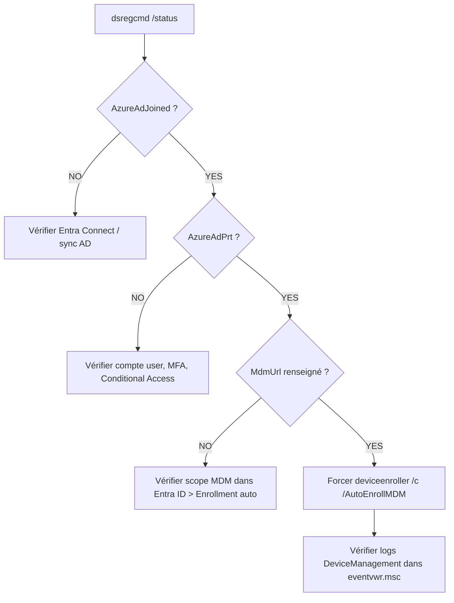

# dsregcmd

`dsregcmd` est l'outil Windows natif pour diagnostiquer et gérer l'état d'un poste vis-à-vis d'Entra ID (Azure AD Join, Hybrid Join, PRT, MDM enrollment). Indispensable en MSP pour comprendre pourquoi un poste n'apparaît pas dans Intune ou ne reçoit pas les politiques.

## Commandes principales

| Commande | Description |
|---|---|
| `dsregcmd /status` | Affiche l'état complet du poste |
| `dsregcmd /leave` | Quitte le join Entra (redémarrage requis pour se rejoindre) |
| `dsregcmd /join` | Force le rejoin (rare, généralement automatique) |

!!! warning "dsregcmd /leave"
    Après `/leave`, le poste n'est plus Entra Joined jusqu'au prochain redémarrage et resynchronisation AD. À utiliser uniquement pour dépannage.

## Lire le résultat de /status

Le résultat est divisé en sections. Voici les sections clés à analyser :

### Device State

```
+----------------------------------------------------------------------+
| Device State                                                         |
+----------------------------------------------------------------------+
AzureAdJoined     : YES       ← Entra ID Join OK
EnterpriseJoined  : NO        ← Normal (pas de MDM legacy)
DomainJoined      : YES       ← Membre du domaine AD on-prem
DomainName        : CONTOSO
```

| Valeur | Signification |
|---|---|
| `AzureAdJoined : YES` | Poste joint à Entra ID |
| `DomainJoined : YES` + `AzureAdJoined : YES` | Hybrid Azure AD Join |
| `AzureAdJoined : NO` | Poste non joint — vérifier la config Entra Connect |

### SSO State — Le PRT

Le PRT (Primary Refresh Token) est le jeton qui permet le SSO et conditionne l'accès aux ressources M365.

```
+----------------------------------------------------------------------+
| SSO State                                                            |
+----------------------------------------------------------------------+
AzureAdPrt        : YES       ← PRT présent = SSO fonctionnel
AzureAdPrtUpdateTime : ...
```

!!! danger "PRT manquant"
    Si `AzureAdPrt : NO`, l'utilisateur n'a pas de SSO M365. Causes fréquentes : compte non synchronisé via Entra Connect, mot de passe expiré, Conditional Access bloquant l'obtention du PRT.

### MDM — Enrollment Intune

```
+----------------------------------------------------------------------+
| MDM                                                                  |
+----------------------------------------------------------------------+
MdmUrl            : https://enrollment.manage.microsoft.com/...
MdmTouUrl         : https://portal.manage.microsoft.com/...
MdmComplianceUrl  : https://portal.manage.microsoft.com/...
```

!!! warning "MdmUrl vide"
    Si les URLs MDM sont vides, l'auto-enrollment Intune ne peut pas fonctionner. Vérifier dans Entra ID > Appareils > Enrollment automatique que le scope MDM est bien configuré.

## Forcer l'enrollment Intune

Si le poste est bien Hybrid Joined mais absent d'Intune, forcer l'enrollment :

```powershell linenums="1"
# Méthode 1 — deviceenroller (CMD, pas PowerShell)
%windir%\system32\deviceenroller.exe /c /AutoEnrollMDM

# Méthode 2 — via le planificateur de tâches
# Ouvrir Task Scheduler > Microsoft > Windows > EnterpriseMgmt
# Clic droit sur la tâche "Schedule created by enrollment client" > Run
```

!!! tip "PowerShell vs CMD"
    La commande `deviceenroller.exe` doit être lancée depuis CMD (invite de commandes), pas depuis PowerShell — PowerShell interprète `%windir%` différemment et génère une erreur.

## Diagnostic pas à pas

Voici le workflow de diagnostic recommandé quand un poste n'apparaît pas dans Intune :



## Logs associés

Dans l'observateur d'événements (`eventvwr.msc`) :

```
Applications and Services Logs
└── Microsoft
    └── Windows
        ├── DeviceManagement-Enterprise-Diagnostics-Provider > Admin
        └── EnterpriseMgmt
```

!!! tip "Filtrer les événements"
    Dans l'observateur, filtrer sur les niveaux Erreur et Avertissement pour aller à l'essentiel. Les Event ID 75, 76, 96 correspondent aux tentatives d'enrollment.

## Cas d'usage MSP fréquents

| Symptôme | Première vérification |
|---|---|
| Poste absent d'Intune | `dsregcmd /status` → section MDM |
| SSO M365 ne fonctionne pas | `dsregcmd /status` → `AzureAdPrt` |
| Politiques Intune non appliquées | Vérifier enrollment + PRT |
| Poste en double dans Entra ID | `dsregcmd /leave` puis redémarrage |
| Nouveau poste Hybrid non enrollé | Attendre 90 min ou forcer `deviceenroller` |

## À lire ensuite

- [Commandes & références MSP](index.md)
- [Get-WindowsAutopilotInfo — Hardware hash](autopilot-hash.md)
- [RDS — Gestion des sessions](rds-sessions.md)
