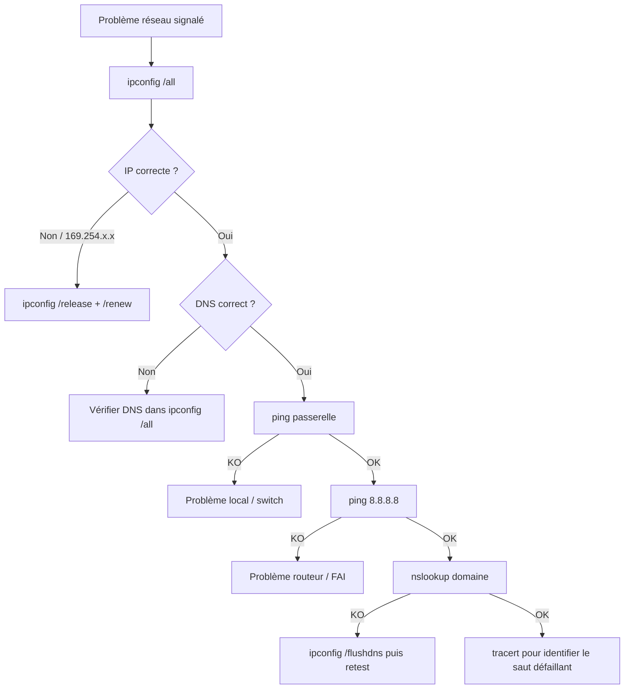

# ipconfig

`ipconfig` est la commande réseau de base sur Windows. Elle affiche et gère la configuration TCP/IP de toutes les interfaces réseau. Premier réflexe sur tout problème de connectivité.

## Options essentielles

```powershell linenums="1"
ipconfig              # Résumé : IP, masque, passerelle
ipconfig /all         # Config complète : IP, MAC, DNS, DHCP, bail
ipconfig /flushdns    # Vider le cache DNS
ipconfig /displaydns  # Afficher le contenu du cache DNS actuel
ipconfig /registerdns # Forcer la réinscription du nom d'hôte dans le DNS
ipconfig /release     # Libérer l'adresse IP DHCP (IPv4)
ipconfig /renew       # Renouveler l'adresse IP DHCP (IPv4)
ipconfig /release6    # Libérer l'adresse IPv6
ipconfig /renew6      # Renouveler l'adresse IPv6
```

## Détail des options clés

### /all — Configuration complète

La plus utilisée en diagnostic. Retourne pour chaque interface :

| Champ | Utilité |
|---|---|
| Adresse physique (MAC) | Identifier la carte réseau |
| DHCP activé | Savoir si l'IP est statique ou dynamique |
| Adresse IPv4 | IP du poste |
| Passerelle par défaut | Routeur / gateway |
| Serveurs DNS | Vérifier que le DNS pointe vers le bon serveur |
| Bail obtenu / expirant | Diagnostic DHCP |

### /flushdns — Vider le cache DNS

À utiliser quand un utilisateur n'arrive pas à accéder à un site ou une ressource après un changement DNS récent (migration, changement d'IP serveur).

```powershell linenums="1"
ipconfig /flushdns
# Résultat attendu :
# La configuration IP de Windows a bien vidé le cache du programme de résolution DNS.
```

!!! tip "Quand utiliser /flushdns"
    Après une migration DNS, un changement d'enregistrement SPF/MX, ou quand un utilisateur signale qu'il n'arrive pas à joindre une ressource interne alors que d'autres y accèdent sans problème.

### /release + /renew — Renouveler le bail DHCP

Séquence classique pour résoudre un conflit d'adresse IP ou forcer l'attribution d'une nouvelle IP :

```powershell linenums="1"
ipconfig /release
ipconfig /renew
```

!!! warning "Sur un poste distant"
    Ne jamais lancer `/release` seul sur un poste accessible uniquement en RDP — la connexion sera coupée. Toujours enchaîner `/release` et `/renew` dans le même script, ou passer par Datto RMM / Intune.

### /registerdns — Réenregistrer le nom d'hôte

Force le poste à se réenregistrer auprès du serveur DNS. Utile quand un poste n'est pas résolu par son nom dans le réseau.

```powershell linenums="1"
ipconfig /registerdns
# Redémarrer le service DNS Client si nécessaire :
net stop dnscache && net start dnscache
```

## Commandes réseau complémentaires

À utiliser en combinaison avec `ipconfig` pour un diagnostic complet :

```powershell linenums="1"
# Tester la connectivité
ping 8.8.8.8              # Accès Internet
ping <nom-serveur>        # Résolution DNS + connectivité

# Tracer le chemin réseau
tracert 8.8.8.8           # Hop par hop vers Internet
pathping <host>           # Combine ping + tracert avec latence par saut

# DNS
nslookup <domaine>        # Résolution DNS manuelle
nslookup <domaine> 8.8.8.8  # Résolution via un DNS spécifique

# Reset pile réseau (en dernier recours)
netsh int ip reset        # Reset TCP/IP (redémarrage requis)
netsh winsock reset       # Reset Winsock (redémarrage requis)
```

!!! danger "netsh int ip reset / winsock reset"
    Ces commandes réinitialisent complètement la pile réseau. À n'utiliser qu'en dernier recours après avoir épuisé les autres options. Toujours redémarrer le poste après.

## Workflow de diagnostic réseau



## Cas d'usage MSP fréquents

| Symptôme | Commande |
|---|---|
| Pas d'accès Internet mais réseau local OK | `ping 8.8.8.8` puis `tracert 8.8.8.8` |
| IP en 169.254.x.x (APIPA) | `ipconfig /release` + `/renew` |
| Site interne inaccessible après migration DNS | `ipconfig /flushdns` |
| Poste non résolu par nom sur le réseau | `ipconfig /registerdns` |
| Conflit d'adresse IP | `ipconfig /release` + `/renew` + vérifier le DHCP |
| Problème de connexion après changement réseau | `netsh winsock reset` + redémarrage |

## À lire ensuite

- [Commandes & références MSP](index.md)
- [dsregcmd — Diagnostic Entra / Intune](dsregcmd.md)
