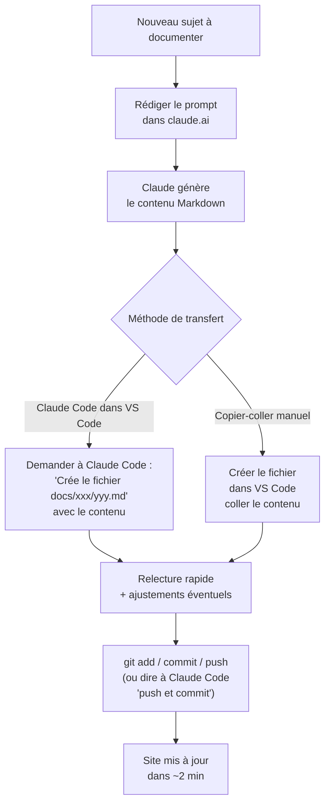

# Workflow KB MkDocs Material

Ce document décrit le setup complet mis en place pour produire et publier cette base de connaissances : de la génération de contenu avec Claude jusqu'au site live sur GitHub Pages.

---

## Architecture globale


---

## Stack technique

| Composant | Rôle | Version / Notes |
|---|---|---|
| **Git** | Versionnement, historique | installé globalement |
| **VS Code** | Éditeur principal, terminal intégré | Extension Claude Code recommandée |
| **Python** | Requis par MkDocs | 3.x (géré par GitHub Actions en CI) |
| **MkDocs Material** | Générateur de site statique | `pip install mkdocs-material` |
| **pymdown-extensions** | Extensions Markdown avancées | inclus avec `mkdocs-material` |
| **Claude Code** | CLI IA dans VS Code | Extension VS Code Anthropic |
| **GitHub Actions** | CI/CD — build et déploiement auto | `.github/workflows/deploy.yml` |
| **GitHub Pages** | Hébergement gratuit du site | branche `gh-pages` auto-gérée |

!!! tip "Installation locale complète"
    ```bash linenums="1"
    pip install mkdocs-material
    pip install pymdown-extensions
    ```
    Pas besoin d'installer autre chose : `mkdocs-material` embarque déjà les extensions pymdownx.

---

## Commandes essentielles

### MkDocs

```bash linenums="1"
# Lancer le serveur de dev avec rechargement automatique
mkdocs serve

# Build statique dans /site (gitignored)
mkdocs build

# Déployer manuellement vers GitHub Pages (remplace le CI)
mkdocs gh-deploy --force
```

### Git

```bash linenums="1"
# Voir l'état du dépôt
git status

# Ajouter des fichiers au prochain commit
git add docs/intune/nouvelle-page.md

# Créer un commit
git commit -m "Ajout page : titre de la page"

# Pousser vers GitHub (déclenche le déploiement automatique)
git push

# Vérifier les commits en avance sur origin
git log origin/main..HEAD --oneline
```

!!! info "Déploiement automatique"
    Chaque `git push` sur `main` déclenche le workflow GitHub Actions qui rebuilde et déploie le site en 1 à 2 minutes. Pas besoin de lancer `mkdocs gh-deploy` manuellement.

---

## Workflow quotidien — ajouter une page

1. **Générer le contenu** avec Claude (claude.ai ou Claude Code dans VS Code)
2. **Créer le fichier** dans le bon sous-dossier de `docs/` :
   ```
   docs/intune/nom-de-la-page.md
   docs/DAtto/nom-de-la-page.md
   ```
3. **Ajouter le frontmatter** en haut du fichier :
   ```yaml
   ---
   title: Titre affiché dans la nav et l'onglet
   description: Une ligne pour le SEO et la recherche
   ---
   ```
4. **Prévisualiser** en local avec `mkdocs serve` (optionnel mais recommandé pour les Mermaid et tableaux complexes)
5. **Commiter et pousser** — via Claude Code ou directement :
   ```bash
   git add docs/intune/nom-de-la-page.md
   git commit -m "Ajout page : Titre de la page"
   git push
   ```
6. **Vérifier le déploiement** dans l'onglet *Actions* du repo GitHub — icône verte = site mis à jour

!!! warning "Pas de `nav:` dans mkdocs.yml"
    La navigation est générée automatiquement depuis l'arborescence `docs/`. Pas besoin de déclarer chaque nouvelle page — il suffit de créer le fichier au bon endroit.

---

## Workflow depuis un projet claude.ai

Le cas typique : travailler sur une procédure dans claude.ai, puis la publier dans le KB.



!!! tip "Prompt type pour Claude Code"
    Dans le chat Claude Code (VS Code), écrire simplement :

    > Crée le fichier `docs/intune/mon-sujet.md` sur le thème "…". Inclure : prérequis, commandes, admonitions, tableau. Format MkDocs Material, français.

    Claude Code connaît les conventions du repo grâce au fichier `CLAUDE.md`.

---

## Raccourcis VS Code utiles

| Raccourci | Action |
|---|---|
| `Ctrl+\`` | Ouvrir / fermer le terminal intégré |
| `Ctrl+Shift+E` | Panneau Explorateur de fichiers |
| `Ctrl+Shift+G` | Panneau Git (voir les fichiers modifiés) |
| `Ctrl+K V` | Prévisualisation Markdown côte à côte |
| `Ctrl+Shift+P` | Palette de commandes (tout faire) |
| `Ctrl+P` | Ouvrir un fichier rapidement par nom |
| `Ctrl+,` | Paramètres VS Code |
| `Ctrl+Shift+\`` | Nouveau terminal |

---

## Claude Code — commandes utiles

Claude Code comprend le langage naturel. Voici les formulations les plus utiles dans ce repo :

| Ce qu'on dit | Ce que ça fait |
|---|---|
| `push et commit` | Crée un commit avec message descriptif et pousse sur `main` |
| `/init` | Analyse le repo et génère / met à jour `CLAUDE.md` |
| `Crée le fichier docs/xxx/yyy.md sur le sujet "…"` | Génère une page complète au format MkDocs Material |
| `Mets à jour mkdocs.yml pour…` | Modifie la config MkDocs |
| `Qu'est-ce qui n'est pas encore poussé ?` | Vérifie `git log origin/main..HEAD` |

!!! note "CLAUDE.md = mémoire contextuelle"
    Le fichier `CLAUDE.md` à la racine du repo est automatiquement lu par Claude Code à chaque session. Il contient les conventions du projet (frontmatter obligatoire, langue française, extensions activées, structure des pages). Garder ce fichier à jour garantit que les pages générées respectent le format sans avoir à le préciser à chaque fois.

---

## Fichiers clés du repo

| Fichier | Rôle |
|---|---|
| `mkdocs.yml` | Configuration complète : thème, couleurs, extensions Markdown, plugins |
| `docs/assets/extra.css` | Styles personnalisés : couleurs Poweriti (#FF6B00), cards page d'accueil |
| `docs/index.md` | Page d'accueil avec les cards de navigation par domaine |
| `CLAUDE.md` | Instructions contextuelles pour Claude Code (conventions, commandes, structure) |
| `.github/workflows/deploy.yml` | Pipeline CI/CD : build MkDocs + déploiement GitHub Pages sur push `main` |
| `.gitignore` | Exclut `/site` (build local) et `.claude/` (settings locaux Claude Code) |

---

## À lire ensuite

- [Windows Autopilot — vue d'ensemble](../intune/autopilot.md)
- [Collecter le hardware hash avec Get-WindowsAutopilotInfo](../intune/autopilot-hash.md)
- [Toast Notifications Datto RMM](../DAtto/Toast notif depuis datto.md)
